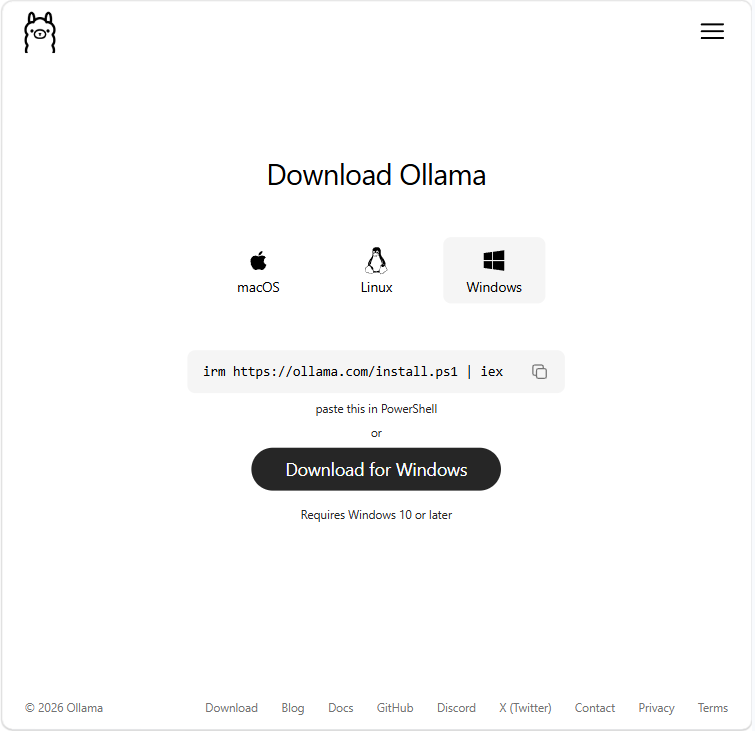

> "A practical, step‑by‑step guide that walks you from a fresh Windows 11 machine to a private, local AI coding assistant in VS Code."  
> "Expect JSON with available models."

---

## TL;DR

Run **Ollama** locally, pull **Granite 3.3:8B**, and configure **Continue.dev** in **VS Code** to get a private, local coding assistant for chat, autocomplete, and embeddings. Use a small coder model for snappy autocomplete and Granite for deeper chat/embeddings.

---

## 1. Overview and prerequisites

**Goal:** Run **Granite 3.3** locally via **Ollama** and connect it to **Continue.dev** in **VS Code** for chat, autocomplete, and embeddings.

**Requirements**
- Windows 11 (fully updated)  
- Administrative access  
- Visual Studio Code installed  
- At least **10–15 GB** free disk space (model + extraction + headroom)  
- Stable internet for model download

**Why local**
- Privacy and data control  
- No per‑request billing  
- Offline capability and full control over models and updates

---

## 2. Install Ollama and download Granite

### 2.1 Download and install Ollama
1. Download the Windows installer from the official Ollama distribution and run it as **Administrator**.  
2. Confirm the `ollama` binary is on your PATH:

**#Powershell**
```powershell
# Powershell
where.exe ollama
ollama --version
```
Screenshot suggestion: installer UI.



### 2.2 Run Ollama
If the installer created a Windows service, check it with PowerShell:

**#Powershell**
```powershell
Get-Service -Name ollama
```
If not, run the server in a persistent way (example: run ollama serve in a dedicated terminal, or create a Windows service using NSSM or Task Scheduler):

**#Powershell**
```powershell
ollama serve
```

### 2.3 Pull Granite model
**#Powershell**
```powershell
ollama pull granite3.3:8b
```
Note: The model is ~5 GB. Allow several minutes for download and extraction. Ensure you have at least 10–15 GB free to avoid extraction issues.


### 2.4 Confirm the model is present

**#Powershell**
```powershell
ollama list
# Expected output includes: granite3.3:8b
```

## 3. Configure Continue.dev in Visual Studio Code
### 3.1 Correct config path
Place your YAML in the local Continue folder. Preferred path:

```Code
C:\Users\<YourUser>\.continue\local\config.yaml
```
If Continue.dev does not detect models, also check:

```Code
C:\Users\<YourUser>\.continue\config.yaml
```
**Hint:** Remove duplicates or conflicting entries.

### 3.2 Recommended YAML (chat, autocomplete, embeddings)
Use this exact YAML in ``C:\Users\<YourUser>\.continue\local\config.yaml``.  It took me a while to work out, that adding the cinfg.yml does not work if added to the ``.continue`` root directory:

**#Yaml**
```yaml
name: Local Config
version: 1.0.0
schema: v1

provider: ollama
api_base: http://localhost:11434

models:
  - name: Granite Chat
    provider: ollama
    model: granite3.3:8b
    role: chat

  - name: Granite Autocomplete
    provider: ollama
    model: qwen2.5-coder:1.5b
    role: autocomplete

  - name: Granite Embeddings
    provider: ollama
    model: granite3.3:8b
    role: embeddings

```

**Why this mix:** Granite for chat/embeddings; a smaller coder model for snappy autocomplete.

### 3.3 Apply changes
Save the YAML file.

Restart VS Code.

Open Continue: ``Ctrl+Shift+P → Continue: Focus Continue Sidebar``.

Confirm the model dropdown lists the configured roles.

Screenshot suggestion: Continue sidebar showing models.


## 4. Verify everything is working
### 4.1 API and model checks (PowerShell)


**#Powershell**
```powershell
# List models
ollama list

# Quick API check
Invoke-RestMethod http://localhost:11434/api/tags

# Check process
Get-Process -Name ollama

# Check port listening
netstat -ano | findstr 11434
```

**Expected:** Invoke-RestMethod returns JSON with available models.

Screenshot suggestion: API JSON output.


### 4.2 VS Code tests
Chat: Highlight code or open the Continue chat and ask a question. The first response may be slow while the model loads (10–30s on CPU).

Autocomplete: Open a code file (e.g., Python) and type a function signature; inline suggestions should appear. If slow, use a smaller autocomplete model.

## 5. Firewall and port access
If you need remote access or your firewall blocks local connections, allow Ollama port 11434:

**#Powershell**
```powershell
New-NetFirewallRule -DisplayName "Ollama API" -Direction Inbound -LocalPort 11434 -Protocol TCP -Action Allow
```
**Security note:** If you expose the port, restrict access to trusted networks only.

## 6. Updating models and Ollama
### 6.1 Update Ollama binary
Re-run the installer or follow official upgrade instructions.

If running as a Windows service, stop the service, replace the binary, then restart the service.

### 6.2 Update a model
**#Powershell**
```powershell
ollama pull granite3.3:8b
# or force refresh
ollama pull --force granite3.3:8b
```
### 6.3 Recover from corruption
**#Powershell**
```powershell
ollama rm granite3.3:8b
ollama pull granite3.3:8b
```
Best practice: Periodically run ollama list and re‑pull models you actively use. Keep a small coder model for autocomplete.

## 7. Removing Ollama and models completely
### 7.1 Stop the server
If running in a terminal, close it or stop the process.

If installed as a service, stop and disable it via Services or PowerShell.

### 7.2 Remove models
**#Powershell**
```powershell
ollama rm granite3.3:8b
ollama list
```
### 7.3 Uninstall Ollama
Use Add/Remove Programs if installed via installer.

Or remove manually:

**#Powershell**
```powershell
Remove-Item -Path "C:\Program Files\Ollama" -Recurse -Force
Remove-Item -Path "C:\Users\<YourUser>\.ollama" -Recurse -Force
```
### 7.4 Clean Continue config
Remove or revert ``.continue\local\config.yaml`` if you no longer want local providers.

## 8. Performance tips and GPU guidance
**Autocomplete:** Use a small coder model (e.g., ``qwen2.5-coder:1.5b``) for low latency.

**Chat vs speed:** Use a larger model for deep chat and a smaller model for inline suggestions.

**Windows GPU (AMD):** Ollama on Windows has limited AMD GPU support; consider LM Studio or ``llama.cpp`` HIP builds for AMD acceleration on Windows.

**Linux GPU (ROCm):** Install ROCm and configure Ollama to use the AMD GPU for best performance on Linux.

## 9. Troubleshooting checklist
``ollama list`` shows the model.

Invoke-RestMethod ``http://localhost:11434/api/tags`` returns JSON.

YAML is in ``.continue/local/config.yaml``.

No duplicate model definitions in other .continue files.

Port ``11434`` is listening and allowed through firewall.

If Connect is greyed out in the GUI: choose **Skip and configure manually** and ensure YAML is authoritative.

## 10. Quick copyable commands (summary)

**#Powershell**
```powershell
# Verify ollama
where.exe ollama
ollama --version

# Pull models
ollama pull granite3.3:8b
ollama pull qwen2.5-coder:1.5b

# List models
ollama list

# API check
Invoke-RestMethod http://localhost:11434/api/tags
```
### Acknowledgements and further reading
[Official Ollama documentation](https://docs.ollama.com/index)

[Continue.dev docs](https://docs.continue.dev/)

[LM Studio / llama.cpp resources for GPU acceleration](https://lmstudio.ai/blog/lmstudio-v0.3.15?utm_source=copilot.com)