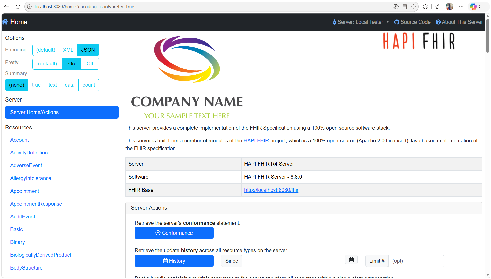

If you, like me, have been experimenting with creating FHIR resouces, at some stage one will need to store those resouces in a FHIR repository.  My first expeinece was using the public HAPI FHIR server.  Then as my needs chaged, I learned that I could continue my development, using my very own HAPI FHIR server run from my local dev environment.

## Why HAPI FHIR

Its cool, being able to run my own stuff, and learn something new along the way.  The HAPI FHIR server is perfect for:
- Development and testing
- Learning FHIR concepts
- Validating resources
- Prototyping integrations

## Prerequisites

Before we begin, you'll need:
- Oracle Java (JDK) installed: Minimum JDK17 or newer.
- Docker (optional but recommended)
- A REST client (Postman, Insomnia, or curl)

## Option 1: Using Docker

The easiest way to get started:

```bash
docker pull hapiproject/hapi:latest
docker run -p 8080:8080 hapiproject/hapi:latest
```
Your server will be available at http://localhost:8080/fhir/

## Option 2: Without Docker

If you prefer not to use Docker, you can run HAPI FHIR directly using Java:

1. Download the latest HAPI FHIR JPA Server CLI from the [GitHub releases page](https://github.com/hapifhir/hapi-fhir-jpaserver-starter/releases)
2. Run it with Java:

```bash
java -jar hapi-fhir-jpaserver.war
```

The server uses an embedded H2 database by default, which is perfect for development. For production use, you'd want to configure it with PostgreSQL or another persistent database.



Once your server is running, you'll see the home page shown above with the HAPI FHIR logo and server information. The interface provides quick access to server actions, resource types, and documentation.

## Testing It Works

Once your server is running, let's verify it's working. Open your browser or REST client and try:

```
GET http://localhost:8080/fhir/metadata
```

You should get back a CapabilityStatement resource describing what your server supports. This is the FHIR equivalent of "Hello World."

To test creating a resource, try posting a simple Patient:

```bash
curl -X POST http://localhost:8080/fhir/Patient \
  -H "Content-Type: application/fhir+json" \
  -d '{
    "resourceType": "Patient",
    "name": [{
      "family": "Smith",
      "given": ["John"]
    }]
  }'
```

If you get back a response with an ID, your server is accepting resources.

## What's Next

Now that you have a working FHIR server, you can:
- Experiment with creating different resource types
- Test your FHIR validation logic - I found this the most usefull!
- Build integrations that POST and GET resources
- Learn about search parameters and queries
- Try out FHIR operations and transactions

The HAPI FHIR server includes a web interface at http://localhost:8080 where you can browse resources, run searches, and test operations without writing code.

## Wrapping Up

Having a local FHIR server changes how I work with FHIR. Instead of relying on public test servers or waiting for infrastructure, I can iterate quickly and experiment freely. I hope that the same will be true for you.  Whether you're learning FHIR concepts, validating your resource structures, or building an integration, having your own instance gives you the freedom to make mistakes and learn from them.

The setup is straightforward, the server is forgiving, and the feedback loop is immediate. That's exactly what you need when you're learning or prototyping.
