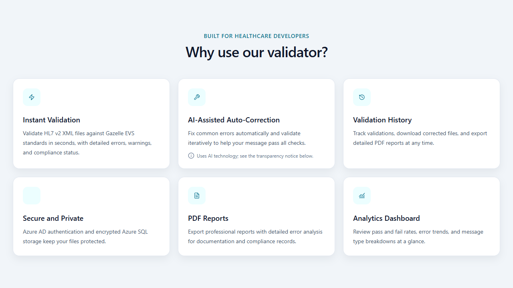
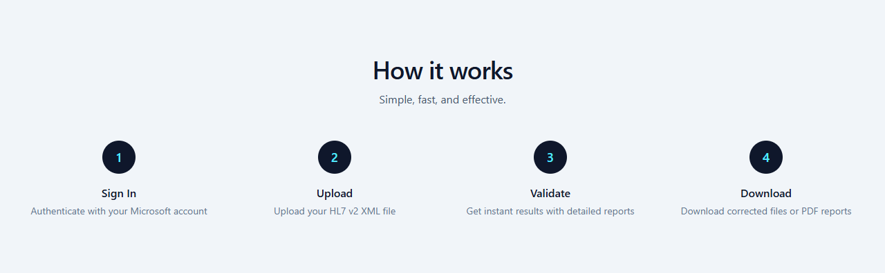
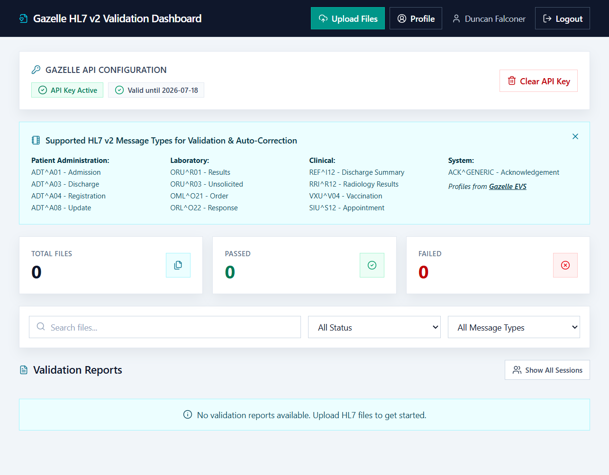
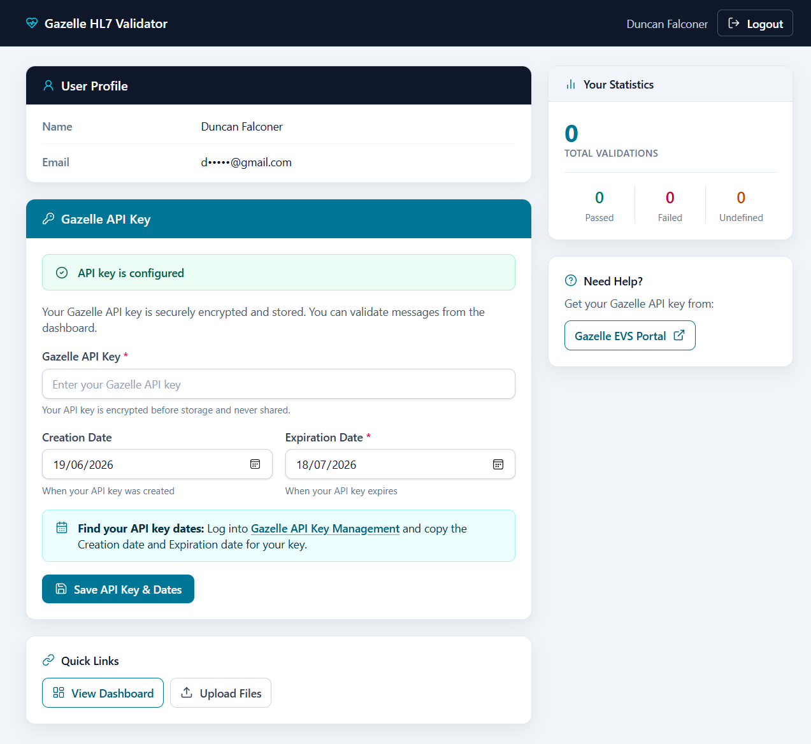
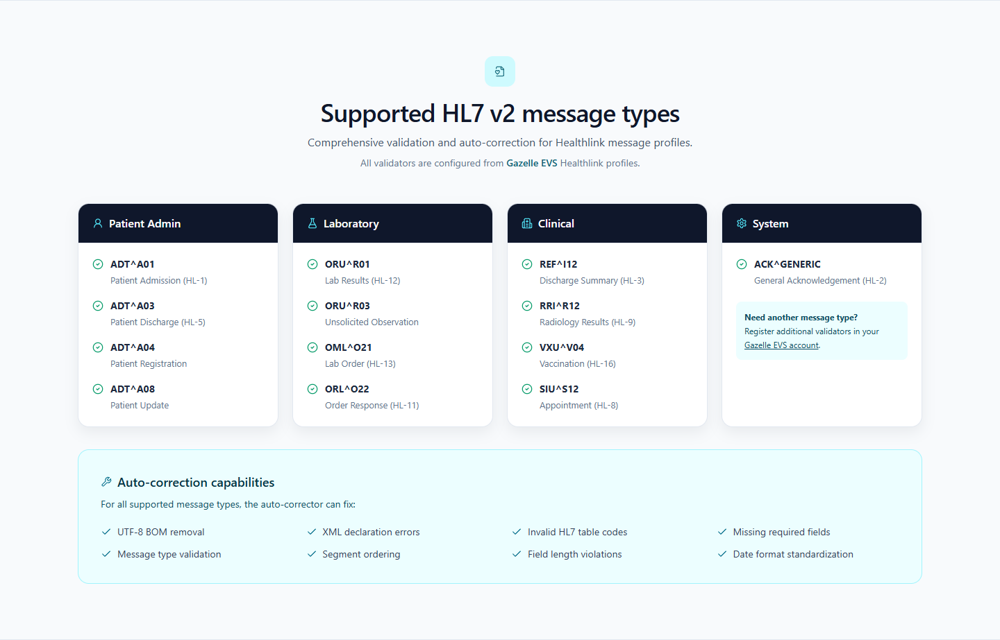

## The Challenge

Validating an HL7 v2 message is rarely a single action. A typical workflow involves submitting a message to a validator, interpreting a detailed report, editing the source, and repeating the process until the message conforms to the required profile.

Some failures require domain expertise and human judgement. Others are predictable and mechanical:

- Encoding artefacts such as a byte order mark
- Missing or malformed XML declarations
- Unsupported values from known HL7 code tables
- Empty required fields
- Structural issues that can be corrected without inventing clinical meaning

The central design question was not simply, “Can these errors be fixed automatically?” It was:

> How can correction be automated without obscuring what changed or creating false confidence in the result?

That distinction shaped the application. Validation remains authoritative, correction is deliberately conservative, and every corrected message must still be reviewed before clinical or production use.

## The Goal

I wanted to create one workflow that could:

- Validate Healthlink HL7 v2 XML messages against configured Gazelle EVS profiles
- Turn technical validation responses into readable results
- Apply deterministic corrections only where a supported rule exists
- Revalidate after each correction cycle
- Process batches without overwhelming the external validation service
- Export reports and corrected messages for review
- Work as a lightweight local tool and as a multi-user production application

The application also needed to handle credentials and potentially sensitive message content responsibly. It is a testing and message-quality tool—not a clinical record system, medical device, or substitute for professional review.

## The Solution

I built a Flask application that coordinates upload, external validation, correction, revalidation, reporting, and history.

[Open the live application](https://hl7-v2-message-validator-a1efcbc737cd.herokuapp.com/) or [inspect the source code](https://github.com/ddeveloper72/HL7_v2_Message_Validator-Auto-Correct).

*The public landing page presents validation, correction, reporting, history, and analytics as one connected workflow.*

### A single validation workflow

For each uploaded message, the application:

1. Stores the file in a session-specific location.
2. Submits it to the configured Gazelle EVS service.
3. Parses the response into status, errors, warnings, message type, and report link.
4. Applies supported rules if auto-correction is enabled and mandatory errors remain.
5. Revalidates the corrected message.
6. Stops when the message passes, no further supported change is available, or the configured iteration limit is reached.
7. Presents the final result and makes the report and corrected file available.

This creates a controlled feedback loop rather than treating auto-correction as a one-off text transformation.

*Four visible stages give users a simple mental model for the end-to-end process.*

### Batch processing without hidden concurrency

Users can upload multiple `.xml` or `.txt` messages and follow progress for each file in the browser. The client processes the batch sequentially.

This was an intentional trade-off. Parallel requests could complete faster, but they would also place avoidable pressure on the external validation service and make progress and failure states harder to understand. Sequential processing gives each file a clear lifecycle and keeps external-service usage predictable.

## Designing the Correction Engine

The correction engine in `hl7_corrector.py` is deterministic and rule-based. It does not send a message to a generative AI model to decide what the corrected content should be.

### Explainable rules

Rules cover supported categories such as:

- Encoding cleanup
- XML and message-structure repair
- Data-driven HL7 code-table corrections
- Required-field handling where a safe rule has been defined

HL7 code values are separated into `hl7_code_tables.json` and loaded through `hl7_code_tables.py`. Keeping this knowledge in data rather than scattering it across conditional code makes the supported values easier to inspect and maintain.

### Conservative stopping conditions

The engine does not assume every validation failure is safely correctable. A correction cycle ends when:

- Gazelle reports a passing result
- No applicable supported rule remains
- A correction would produce no further change
- The maximum iteration count is reached

These boundaries matter. The application can automate known transformations, but it cannot infer missing clinical facts or guarantee that a syntactically valid message is clinically correct.

### Validation remains external and authoritative

The application does not replace Gazelle EVS with its own interpretation of conformance. After every supported correction, the message is sent back to Gazelle. This keeps correction and validation as separate responsibilities:

- The correction engine proposes deterministic changes.
- Gazelle evaluates conformance against the selected profile.
- A human reviews the final message and report.

## Architecture

The primary application entry point is `dashboard_app.py`, which coordinates routes, sessions, authentication, reports, and validation jobs.

The main components are:

- **Flask** for request handling and workflow orchestration
- **Gazelle EVS** for profile-based HL7 validation
- **`validate_with_verification.py`** for submission and response parsing
- **`hl7_corrector.py`** for deterministic correction rules
- **Tailwind CSS and Lucide icons** for the dashboard interface
- **ReportLab** for server-side PDF generation
- **Azure SQL** for durable, per-user production history
- **Microsoft Entra ID** for production authentication
- **Docker and Gunicorn** for a repeatable deployment environment

*The dashboard gives authenticated users one place to manage uploads, inspect validation status, filter results, and open reports.*

### Two operating modes

The project supports two distinct modes rather than forcing production infrastructure into local development.

**Local mode** is designed for development, demonstrations, and single-user use. Authentication is bypassed, results can use temporary or session storage, and the Gazelle API key can remain in the local session.

**Production mode** enables Microsoft Entra ID sign-in, per-user history and statistics, Azure SQL persistence, and encrypted storage for each user's Gazelle API credentials.

This separation keeps local setup approachable while allowing the same application to adopt stronger identity and persistence controls when deployed for multiple users.

*The profile makes credential status, key dates, quick links, and per-user statistics visible without displaying the stored API key. The email address is masked for privacy.*

## Security and Data Handling

HL7 messages may contain personal or clinical data, so ordinary upload security is not enough. The application includes:

- CSRF protection through Flask-WTF
- Server-side filesystem sessions
- HTTP-only and same-site cookies, with secure cookies in production
- Content Security Policy and other response security headers
- Rate limits on sensitive write operations
- Filename sanitisation and upload-type restrictions
- HTML sanitisation for report content
- Parameterised database access
- Fernet encryption for API keys stored in production

Technology controls do not resolve governance questions on their own. Operators still need approved retention, deletion, privacy, and external-processing policies, including permission to submit message content to the configured Gazelle service.

## Key Engineering Decisions

### ReportLab instead of browser-based PDF generation

The current implementation generates PDFs with ReportLab. This removes the need to run a headless browser solely for report export and makes server-side PDF generation more predictable in containers and hosted environments.

### Server-side sessions instead of client-held application state

Filesystem-backed Flask sessions keep application state on the server while the browser receives only the session cookie. This supports temporary local workflows and avoids placing uploaded message details directly into client-side session data.

### Data-driven code tables

Separating HL7 table data from correction logic makes the rule set more transparent. It also reduces the risk of changing orchestration code when a table value needs to be reviewed or extended.

### External validation after every correction

Revalidation costs an additional service request, but it provides an essential safety boundary. The application never treats “a rule ran successfully” as equivalent to “the message now conforms.”

## Supporting Multiple Message Profiles

The interface exposes configured profiles across patient administration, laboratory, clinical, and system workflows, including:

- `ADT^A01`, `ADT^A03`, `ADT^A04`, and `ADT^A08`
- `ORU^R01`, `ORU^R03`, `OML^O21`, and `ORL^O22`
- `REF^I12`, `RRI^R12`, `VXU^V04`, and `SIU^S12`
- Generic acknowledgements

The connected Gazelle instance remains the source of truth for actual profile availability and configuration.

*The current public deployment groups its configured validators by healthcare workflow.*

## How the Project Evolved

The application grew from a simpler validator into a fuller workflow platform. The current version adds capabilities that materially change how it can be used:

- Multi-file upload and visible batch progress
- Iterative correction and revalidation
- Downloadable corrected messages and PDF reports
- Local and production operating modes
- Microsoft Entra ID authentication
- Azure SQL validation history and user statistics
- Encrypted per-user credential storage in production
- Container deployment and health checks
- Explicit AI-use and clinical-safety documentation

The public repository also documents an important limitation: it does not currently include a standalone open-source licence. The code is visible for review, but public visibility should not be interpreted as granting reuse rights.

## What I Learned

### Automation needs visible boundaries

In a healthcare workflow, a feature called “auto-correct” can imply more certainty than the software can justify. Clear stopping conditions, repeated external validation, and explicit review guidance are part of the feature—not peripheral disclaimers.

### Passing validation is not the same as being clinically correct

Conformance testing can identify structural and coded-value problems. It cannot establish that the message represents the right patient, event, observation, or clinical intent. The interface and documentation need to preserve that distinction.

### Local simplicity and production controls can coexist

Separating application modes made it possible to keep the project easy to run locally without weakening the design of a multi-user deployment. Identity, durable history, and encrypted credentials become requirements only in the environment where they are needed.

### External services shape user experience

Gazelle EVS is not just an implementation dependency. Its response times, credentials, profile configuration, and report format all affect the application flow. Sequential batches, visible progress, useful failure messages, and report links help make that dependency understandable to users.

### Domain rules are maintainable when they are inspectable

Correction logic is easier to trust when supported values and transformations can be reviewed directly. Data-driven tables and narrowly scoped rules are less magical—and in this context, less magical is a virtue.

## Outcome

The result is a public, deployable reference implementation that brings validation, supported correction, revalidation, reporting, and history into one workflow. It demonstrates how domain-specific automation can remove repetitive work while retaining external verification and human review as explicit safety boundaries.

The most important outcome is not that every error can be corrected automatically. It is that the application knows when it can make a supported change, verifies the result, and stops when judgement is required.
